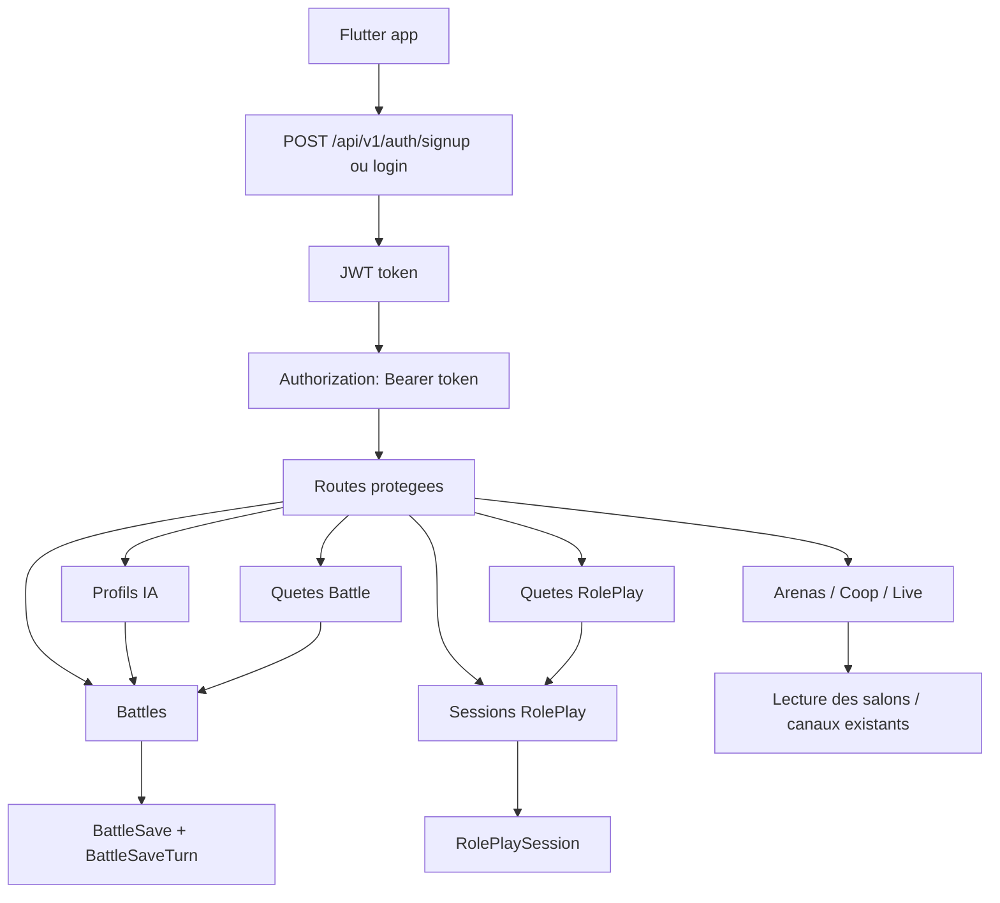
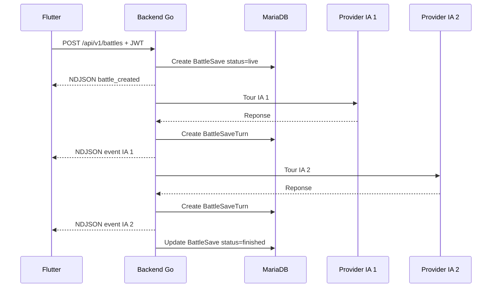
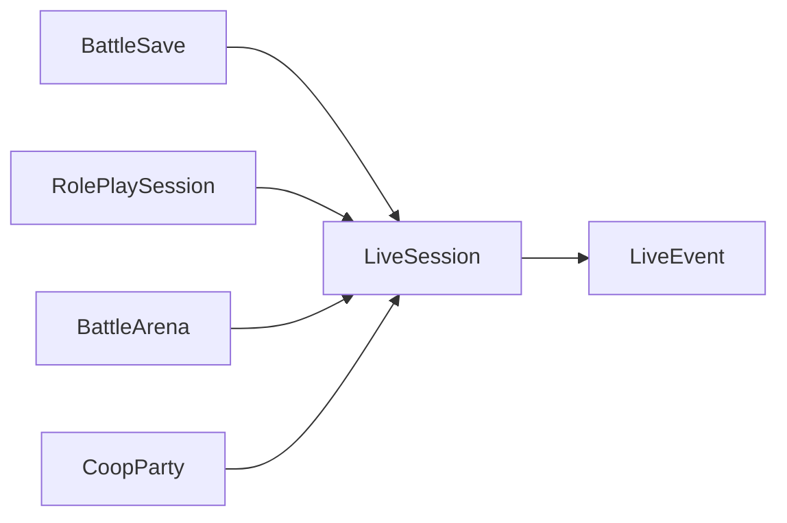

# API go-battle-ia

Ce document explique comment utiliser les routes exposees par le backend.

Base locale par defaut :

```text
http://localhost:8080
```

Sur Android Emulator, utilise plutot :

```text
http://10.0.2.2:8080
```

## Vue Generale



## Authentification

Les routes publiques ne demandent pas de token :

```text
POST /api/v1/auth/signup
POST /api/v1/auth/login
POST /api/v1/subscrit
GET  /api/v1/ai/providers
GET  /ping
```

Toutes les autres routes demandent ce header :

```http
Authorization: Bearer <token>
```

Le token est renvoye par `signup` et `login`.

### Signup

```http
POST /api/v1/auth/signup
Content-Type: application/json
```

Body :

```json
{
  "email": "player@mail.com",
  "password": "password123",
  "pseudo": "PlayerOne"
}
```

Reponse :

```json
{
  "token": "...",
  "expires_in": 86400,
  "user": {
    "id": 1,
    "email": "player@mail.com",
    "pseudo": "PlayerOne",
    "avatar": "",
    "xp": 0,
    "coin": 0
  }
}
```

### Login

```http
POST /api/v1/auth/login
Content-Type: application/json
```

Body accepte :

```json
{
  "email": "player@mail.com",
  "password": "password123"
}
```

ou :

```json
{
  "user": "player@mail.com",
  "password": "password123"
}
```

## Exemple Flutter

```dart
final response = await http.post(
  Uri.parse('$apiBaseUrl/api/v1/auth/login'),
  headers: {'Content-Type': 'application/json'},
  body: jsonEncode({
    'email': 'player@mail.com',
    'password': 'password123',
  }),
);

final token = jsonDecode(response.body)['token'];
```

Pour une route protegee :

```dart
final response = await http.get(
  Uri.parse('$apiBaseUrl/api/v1/me'),
  headers: {
    'Authorization': 'Bearer $token',
  },
);
```

## Providers IA

### Lister les fournisseurs IA

```http
GET /api/v1/ai/providers
```

Cette route ne demande pas de JWT. Elle sert a alimenter les selects Flutter sans coder les fournisseurs en dur.

Reponse :

```json
{
  "names": ["mistral", "openai", "openrouter", "xia"],
  "providers": [
    {
      "name": "mistral",
      "displayName": "Mistral",
      "aliases": ["mistral"],
      "chatCompletionsCompatible": true
    },
    {
      "name": "openai",
      "displayName": "OpenAI",
      "aliases": ["openai", "openapi", "open_api"],
      "chatCompletionsCompatible": true
    },
    {
      "name": "openrouter",
      "displayName": "OpenRouter",
      "aliases": ["openrouter", "open_router"],
      "chatCompletionsCompatible": true
    },
    {
      "name": "xia",
      "displayName": "xAI",
      "aliases": ["xia", "xai", "x-ai"],
      "chatCompletionsCompatible": true
    }
  ]
}
```

### Tester une cle provider IA

```http
POST /api/v1/ai/providers/test
Authorization: Bearer <token>
Content-Type: application/json
```

Cette route teste que le fournisseur, le modele et la cle API communiquent correctement. La cle est utilisee uniquement pour cet appel et n'est jamais sauvegardee.

Body :

```json
{
  "providerName": "mistral",
  "modelName": "mistral-large-latest",
  "apiKey": "ta-cle-api",
  "prompt": "Reponds uniquement OK"
}
```

`prompt` est optionnel. `provider` et `model` sont aussi acceptes comme alias de `providerName` et `modelName`.

Reponse si le test fonctionne :

```json
{
  "ok": true,
  "providerName": "mistral",
  "modelName": "mistral-large-latest",
  "latencyMs": 823,
  "response": "OK"
}
```

Reponse si la cle, le modele ou le provider echoue :

```json
{
  "ok": false,
  "providerName": "mistral",
  "modelName": "mistral-large-latest",
  "latencyMs": 421,
  "error": "..."
}
```

Le timeout est configure par `AI_PROVIDER_TEST_TIMEOUT_SECONDS` avec `20` secondes par defaut.

Les noms principaux acceptes par le backend :

```text
mistral
openai
openapi
openrouter
xia
xai
x-ai
```

`claude` est liste dans `apiUrl.txt`, mais il n'est pas encore actif dans le backend car Anthropic n'utilise pas exactement le meme format de stream OpenAI.

## Routes Utilisateur

### Recuperer mon profil

```http
GET /api/v1/me
Authorization: Bearer <token>
```

Retour :

```json
{
  "user": {
    "id": 1,
    "email": "player@mail.com",
    "pseudo": "PlayerOne",
    "avatar": "",
    "xp": 0,
    "coin": 0
  }
}
```

### Modifier mon profil

```http
PUT /api/v1/me
PATCH /api/v1/me
Authorization: Bearer <token>
Content-Type: application/json
```

Body partiel accepte :

```json
{
  "email": "new-player@mail.com",
  "pseudo": "NewPseudo",
  "birthdayDate": "1998-04-12",
  "avatar": "https://cdn.example.com/avatar.png"
}
```

Pour changer le mot de passe, `currentPassword` est obligatoire :

```json
{
  "currentPassword": "ancien-password",
  "newPassword": "nouveau-password"
}
```

Reponse :

```json
{
  "updated": true,
  "token": "...",
  "expires_in": 86400,
  "user": {
    "id": 1,
    "email": "new-player@mail.com",
    "pseudo": "NewPseudo",
    "avatar": "https://cdn.example.com/avatar.png",
    "xp": 0,
    "coin": 0
  }
}
```

Le backend renvoie un nouveau token apres modification pour que Flutter garde des claims synchronises.

### Modifier xp / coin d'un utilisateur

```http
PATCH /api/v1/users/:id/progression
Authorization: Bearer <token>
X-Admin-Secret: <ADMIN_API_SECRET>
Content-Type: application/json
```

Cette route est reservee au backend admin / outils de gestion. Elle ne doit pas etre appelee directement depuis Flutter avec un secret embarque dans l'app.

Body pour fixer une valeur exacte :

```json
{
  "xp": 120,
  "coin": 40,
  "reason": "correction-admin"
}
```

Body pour ajouter ou retirer une valeur :

```json
{
  "xpDelta": 25,
  "coinDelta": -5,
  "reason": "reward-battle"
}
```

Au moins un champ parmi `xp`, `coin`, `xpDelta`, `coinDelta` est obligatoire. Le backend refuse un resultat negatif.

Reponse :

```json
{
  "updated": true,
  "reason": "reward-battle",
  "user": {
    "id": 1,
    "email": "player@mail.com",
    "pseudo": "PlayerOne",
    "avatar": "",
    "xp": 145,
    "coin": 35
  }
}
```

## Profils IA

Un profil IA sert a sauvegarder une personnalite reutilisable dans une battle.
Il ne stocke pas la cle API.

### Creer un profil IA

```http
POST /api/v1/ia-profiles
Authorization: Bearer <token>
Content-Type: application/json
```

Body :

```json
{
  "name": "Nova",
  "providerName": "mistral",
  "modelName": "mistral-large-latest",
  "personality": "Curieuse et analytique",
  "mindset": "Cherche les contradictions",
  "style": "Energique avec piques amicales",
  "goal": "Prouver que son angle est le plus solide",
  "weakness": "Peut trop complexifier"
}
```

Champs attendus :

```text
name         obligatoire
providerName optionnel mais valide si present: mistral, openai, openrouter, xia
modelName    optionnel, ex: mistral-large-latest
personality  optionnel
mindset      optionnel
style        optionnel
goal         optionnel
weakness     optionnel
```

Reponse :

```json
{
  "profile": {
    "Id": 1,
    "OwnerID": 1,
    "Name": "Nova",
    "ProviderName": "mistral",
    "ModelName": "mistral-large-latest",
    "Personality": "Curieuse et analytique",
    "Mindset": "Cherche les contradictions",
    "Style": "Energique avec piques amicales",
    "Goal": "Prouver que son angle est le plus solide",
    "Weakness": "Peut trop complexifier"
  }
}
```

### Lister mes profils IA

```http
GET /api/v1/ia-profiles
Authorization: Bearer <token>
```

### Recuperer / modifier / supprimer

```text
GET    /api/v1/ia-profiles/:id
PUT    /api/v1/ia-profiles/:id
DELETE /api/v1/ia-profiles/:id
```

Important : un utilisateur ne peut lire/modifier/supprimer que ses propres profils IA.

Routes liees aux profils IA :

```text
GET  /api/v1/ai/providers        liste les fournisseurs IA utilisables
GET  /api/v1/ia-profiles         liste les profils du joueur connecte
POST /api/v1/ia-profiles         cree un profil IA
GET  /api/v1/ia-profiles/:id     recupere un profil IA
PUT  /api/v1/ia-profiles/:id     modifie un profil IA
DELETE /api/v1/ia-profiles/:id   supprime un profil IA
POST /api/v1/battle              peut utiliser ia1ProfileId / ia2ProfileId
POST /api/v1/battles             alias de creation de battle
POST /api/v1/battles/:id/resume  peut reutiliser les providers/modeles du snapshot et demander les cles API
```

## Quetes Battle

Les quetes battle sont des sujets de debat sauvegardes en base.

### Lister les quetes

```http
GET /api/v1/battle-quests
Authorization: Bearer <token>
```

Filtres possibles :

```text
?status=published
?status=all
?theme=technologie
?level=moyen
?limit=20
```

Par defaut, l'API renvoie seulement les quetes `published`.

### Recuperer une quete

```http
GET /api/v1/battle-quests/:id
Authorization: Bearer <token>
```

### Creer une quete

```http
POST /api/v1/battle-quests
Authorization: Bearer <token>
Content-Type: application/json
```

Body :

```json
{
  "title": "Le frigo juge tes repas",
  "content": "Un frigo intelligent doit-il avoir le droit de juger tes repas ?",
  "level": "facile",
  "theme": "quotidien",
  "point": 10,
  "xp": 25,
  "coin": 5,
  "mode": "battle_ia",
  "source": "manual",
  "status": "published"
}
```

## Battles

Une battle lance un stream NDJSON et sauvegarde :

- une ligne `BattleSave`
- plusieurs lignes `BattleSaveTurn`

### Schema Battle



### Lancer une battle avec deux profils IA

```http
POST /api/v1/battles
Authorization: Bearer <token>
Content-Type: application/json
```

Body :

```json
{
  "question": "Un frigo intelligent doit-il juger tes repas ?",
  "title": "Battle du frigo",
  "visibility": "private",
  "provider1": "mistral",
  "provider2": "openai",
  "iaKey1": "CLE_PROVIDER_1",
  "iaKey2": "CLE_PROVIDER_2",
  "iaModels": "mistral-large-latest",
  "iaModels2": "gpt-4o-mini",
  "ia1ProfileId": 1,
  "ia2ProfileId": 2
}
```

Si `ia1ProfileId` ou `ia2ProfileId` est fourni, le backend complete les champs `name`, `personality`, `mindset`, `style`, `goal`, `weakness`, `providerName` et `modelName` depuis le profil.

### Lancer une battle sans profil IA

```json
{
  "question": "Les ascenseurs devraient-ils avoir de l'humour ?",
  "provider1": "mistral",
  "provider2": "xia",
  "iaKey1": "CLE_MISTRAL",
  "iaKey2": "CLE_XAI",
  "iaModels": "mistral-large-latest",
  "iaModels2": "grok-3-mini",
  "ia1Name": "Nova",
  "ia1Personality": "Logique",
  "ia1Mindset": "Cherche les failles",
  "ia1Style": "Direct",
  "ia1Goal": "Convaincre vite",
  "ia1Weakness": "Impatiente",
  "ia2Name": "Orion",
  "ia2Personality": "Creatif",
  "ia2Mindset": "Pense en analogies",
  "ia2Style": "Humour",
  "ia2Goal": "Rendre le debat vivant",
  "ia2Weakness": "Peut digresser"
}
```

### Lancer une battle depuis une quete

```json
{
  "questId": 12,
  "provider1": "mistral",
  "provider2": "openrouter",
  "iaKey1": "CLE_1",
  "iaKey2": "CLE_2",
  "iaModels": "mistral-large-latest",
  "iaModels2": "openai/gpt-4o-mini",
  "ia1ProfileId": 1,
  "ia2ProfileId": 2
}
```

Si `questId` est fourni et que `question` est vide, le backend prend `question` depuis la quete publiee.

### Reponse stream NDJSON

La route ne renvoie pas un JSON unique. Elle renvoie une ligne JSON par evenement :

```json
{"type":"battle_created","battle_id":7,"done":true}
{"ia":"Nova","round":1,"type":"definition_avis","content":"...","done":false}
{"ia":"Nova","round":1,"type":"definition_avis","content":"","done":true}
```

Cote Flutter, il faut lire le stream ligne par ligne.

### Lire les battles sauvegardees

```text
GET  /api/v1/battles
GET  /api/v1/battles/:id
GET  /api/v1/battles/:id/turns
POST /api/v1/battles/:id/resume
POST /api/v1/battles/:id/cancel
```

Un utilisateur ne voit que ses propres battles.

### Reprendre une battle

```http
POST /api/v1/battles/:id/resume
Authorization: Bearer <token>
Content-Type: application/json
```

Le backend recharge `BattleSave` et `BattleSaveTurn`, reconstruit l'historique, puis continue le debat en stream NDJSON.

Les providers, modeles et profils IA sont sauvegardes dans `IASnapshot`.
Les cles API ne sont pas stockees en base, donc il faut les renvoyer au moment du resume :

```json
{
  "iaKey1": "CLE_PROVIDER_1",
  "iaKey2": "CLE_PROVIDER_2"
}
```

Tu peux aussi renvoyer `provider1`, `provider2`, `iaModels`, `iaModels2`, `ia1ProfileId` et `ia2ProfileId` si tu veux forcer une nouvelle config. Sinon le service reprend `providerName`, `modelName`, noms et personnalites depuis `IASnapshot`.

## Quetes RolePlay

Les quetes RP sont des templates de scenario.

### Lister les quetes RP

```http
GET /api/v1/roleplay/quests
Authorization: Bearer <token>
```

Filtres possibles :

```text
?status=published
?status=all
?theme=fantasy
?level=difficile
?limit=20
```

### Recuperer une quete RP

```http
GET /api/v1/roleplay/quests/:id
Authorization: Bearer <token>
```

### Creer une quete RP

```http
POST /api/v1/roleplay/quests
Authorization: Bearer <token>
Content-Type: application/json
```

Body :

```json
{
  "title": "La cite sous la pluie noire",
  "summary": "Une enquete sombre dans une ville steampunk.",
  "prompt": "Les joueurs arrivent dans une cite ou la pluie efface les souvenirs...",
  "theme": "steampunk",
  "level": "moyen",
  "xp": 80,
  "coin": 30,
  "source": "manual",
  "status": "published"
}
```

## Sessions RolePlay

Routes actuellement disponibles :

```text
GET /api/v1/roleplay/sessions
GET /api/v1/roleplay/sessions/:id
```

Ces routes lisent les sessions RP deja creees en base pour l'utilisateur connecte.

Important : il n'y a pas encore de route `POST /api/v1/roleplay/sessions` dans le code actuel. Donc le frontend peut afficher les sessions existantes, mais pas encore lancer une nouvelle session RP via API.

## Arenas

Routes disponibles :

```text
GET /api/v1/arenas
GET /api/v1/arenas/:code
```

Une arena represente une salle publique autour d'une battle.

Etat actuel :

- `GET /arenas` liste les arenas existantes.
- `GET /arenas/:code` recupere une arena par code.
- Les routes pour creer, rejoindre et quitter une arena ne sont pas encore implementees.

## Coop

Route disponible :

```text
GET /api/v1/coop/parties
```

Cette route liste les parties coop dont l'utilisateur connecte est l'hote.

Etat actuel :

- Lecture uniquement.
- Pas encore de route pour creer/rejoindre/quitter une coop.

## Live Sessions

Routes disponibles :

```text
GET /api/v1/live/sessions
POST /api/v1/live/sessions
GET /api/v1/live/sessions/:id
GET /api/v1/live/sessions/:id/events
GET /api/v1/live/:channel/stream
POST /api/v1/live/sessions/:id/end
```

Une `LiveSession` est un canal de live sauvegarde en base. Elle peut etre rattachee a :

- une battle
- une session RP
- une arena
- une coop party

### Schema Live



### Creer une live session

```http
POST /api/v1/live/sessions
Authorization: Bearer <token>
Content-Type: application/json
```

Body minimal :

```json
{
  "mode": "battle_ia",
  "allowReplay": true
}
```

Body rattache a une battle :

```json
{
  "mode": "battle_ia",
  "battleSaveId": 7,
  "allowReplay": true
}
```

Body rattache a une session RP :

```json
{
  "mode": "roleplay_ia",
  "rolePlaySessionId": 3,
  "allowReplay": true
}
```

Le backend cree un `channelKey` automatiquement si tu ne l'envoies pas.

Reponse :

```json
{
  "session": {
    "Id": 1,
    "OwnerID": 1,
    "ChannelKey": "live-a1b2c3...",
    "Mode": "battle_ia",
    "Status": "streaming",
    "AllowReplay": true
  }
}
```

Regle de securite : la session live appartient au user connecte. Si tu rattaches `battleSaveId`, `rolePlaySessionId`, `arenaId` ou `coopPartyId`, la ressource doit aussi appartenir au user connecte.

### Lister et lire une live session

```text
GET  /api/v1/live/sessions
GET  /api/v1/live/sessions/:id
GET  /api/v1/live/sessions/:id/events
```

`GET /api/v1/live/sessions/:id/events` accepte :

```text
?after=0
?limit=100
```

`after` permet de ne recuperer que les events avec `sequence > after`.

### Stream WebSocket

Le stream live est en WebSocket :

```text
GET /api/v1/live/:channel/stream
```

Exemple d'URL locale :

```text
ws://localhost:8080/api/v1/live/live-a1b2c3/stream
```

Cette route est protegee par JWT. Depuis Flutter, passe le token dans les headers de connexion WebSocket si ta librairie le permet :

```dart
final channel = WebSocketChannel.connect(
  Uri.parse('ws://localhost:8080/api/v1/live/$channelKey/stream'),
  headers: {
    'Authorization': 'Bearer $token',
  },
);
```

Messages recus :

```json
{
  "type": "live_connected",
  "session": {}
}
```

Puis pour chaque event :

```json
{
  "type": "live_event",
  "event": {
    "Id": 1,
    "LiveSessionID": 1,
    "Sequence": 1,
    "EventType": "status",
    "AuthorType": "system",
    "AuthorName": "system",
    "Payload": {
      "status": "streaming",
      "channel": "live-a1b2c3",
      "message": "live session created"
    }
  }
}
```

Quand le live est termine :

```json
{
  "type": "live_ended",
  "session": {}
}
```

### Terminer une live session

```http
POST /api/v1/live/sessions/:id/end
Authorization: Bearer <token>
```

Le backend passe la session en `ended`, ajoute un `LiveEvent` de status, puis les clients WebSocket recoivent `live_ended`.

### Historique live par channel

```http
GET /api/v1/live/:channel/history?after=0&limit=100
Authorization: Bearer <token>
```

Retourne la session live et les events persistants. Cette route sert a rejouer l'historique si le WebSocket coupe.

## Arena Et Coop

Arena :

```text
POST /api/v1/arenas
POST /api/v1/arenas/:code/join
POST /api/v1/arenas/:code/leave
GET  /api/v1/arenas/:code/members
```

Coop :

```text
POST /api/v1/coop/parties
GET  /api/v1/coop/parties/:code
POST /api/v1/coop/parties/:code/join
POST /api/v1/coop/parties/:code/leave
POST /api/v1/coop/parties/:code/ready
GET  /api/v1/coop/parties/:code/members
PUT  /api/v1/coop/parties/:code/state
```

Le host est ajoute automatiquement comme membre `host` a la creation d'une arena ou d'une coop.

## Securite Et Charge

Toutes les routes protegees passent par :

- JWT Bearer
- queue HTTP
- limite de taille de body
- headers securite

Exception volontaire : le WebSocket `GET /api/v1/live/:channel/stream` est protege par JWT, mais ne passe pas dans la queue HTTP. Sinon une connexion WebSocket longue garderait un slot de queue ouvert et bloquerait les autres routes.

Variables configurables :

```text
JWT_SECRET
APP_MAX_CONCURRENT_REQUESTS
APP_QUEUE_TIMEOUT_SECONDS
APP_MAX_BODY_BYTES
DB_MAX_OPEN_CONNS
DB_MAX_IDLE_CONNS
DB_CONN_MAX_LIFETIME_MINUTES
```

Si le serveur est trop charge, la queue peut repondre :

```http
503 Service Unavailable
```

avec :

```json
{
  "error": "server busy, retry later"
}
```

## Codes De Reponse Courants

```text
200 OK
201 Created
400 Bad Request
401 Unauthorized
404 Not Found
409 Conflict
503 Service Unavailable
```

## Resume Des Routes

```text
GET  /ping

POST /api/v1/auth/signup
POST /api/v1/auth/login
POST /api/v1/subscrit
GET  /api/v1/ai/providers

GET  /api/v1/me
PUT  /api/v1/me
PATCH /api/v1/me
POST /api/v1/ai/providers/test
PATCH /api/v1/users/:id/progression

POST /api/v1/battle
POST /api/v1/battles
GET  /api/v1/battles
GET  /api/v1/battles/:id
GET  /api/v1/battles/:id/turns
POST /api/v1/battles/:id/resume
POST /api/v1/battles/:id/cancel

GET  /api/v1/battle-quests
GET  /api/v1/battle-quests/random
GET  /api/v1/battle-quests/:id
POST /api/v1/battle-quests
PUT  /api/v1/battle-quests/:id
DELETE /api/v1/battle-quests/:id
POST /api/v1/battle-quests/:id/publish
POST /api/v1/battle-quests/:id/archive

GET    /api/v1/ia-profiles
POST   /api/v1/ia-profiles
GET    /api/v1/ia-profiles/:id
PUT    /api/v1/ia-profiles/:id
DELETE /api/v1/ia-profiles/:id

GET  /api/v1/roleplay/quests
GET  /api/v1/roleplay/quests/:id
POST /api/v1/roleplay/quests
PUT  /api/v1/roleplay/quests/:id
DELETE /api/v1/roleplay/quests/:id
POST /api/v1/roleplay/quests/:id/start
POST /api/v1/roleplay/sessions
GET  /api/v1/roleplay/sessions
GET  /api/v1/roleplay/sessions/:id
GET  /api/v1/roleplay/sessions/:id/turns
POST /api/v1/roleplay/sessions/:id/resume
POST /api/v1/roleplay/sessions/:id/action
POST /api/v1/roleplay/sessions/:id/end

GET  /api/v1/arenas
POST /api/v1/arenas
GET  /api/v1/arenas/:code
POST /api/v1/arenas/:code/join
POST /api/v1/arenas/:code/leave
GET  /api/v1/arenas/:code/members
POST /api/v1/coop/parties
GET  /api/v1/coop/parties
GET  /api/v1/coop/parties/:code
POST /api/v1/coop/parties/:code/join
POST /api/v1/coop/parties/:code/leave
POST /api/v1/coop/parties/:code/ready
GET  /api/v1/coop/parties/:code/members
PUT  /api/v1/coop/parties/:code/state
GET  /api/v1/live/sessions
POST /api/v1/live/sessions
GET  /api/v1/live/sessions/:id
GET  /api/v1/live/sessions/:id/events
GET  /api/v1/live/:channel/stream
GET  /api/v1/live/:channel/history
POST /api/v1/live/sessions/:id/end
```
